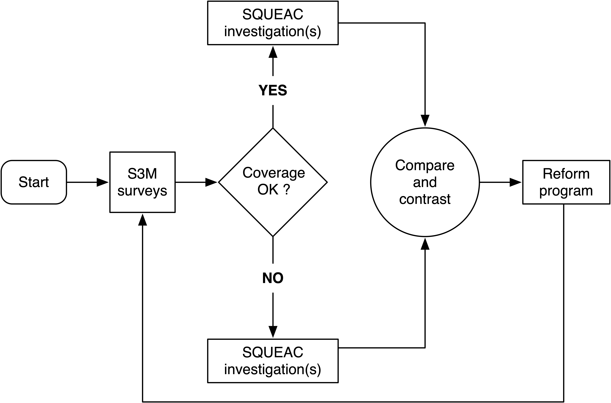
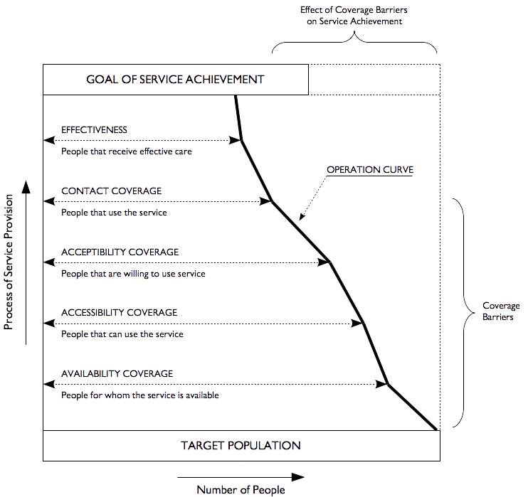

```{r setup, include=FALSE}
knitr::opts_chunk$set(echo = FALSE)

suppressPackageStartupMessages(source("packages.R"))
for (f in list.files(here::here("R"), full.names = TRUE)) source (f)

targets::tar_load(
  c(lbr_counties, lbr_districts, lbr_clans,
    urban_montserrado, grand_bassa, urban_montserrado_ea, grand_bassa_ea,
    urban_montserrado_ea_centroids, grand_bassa_ea_centroids,
    urban_montserrado_sp, grand_bassa_sp,
    urban_montserrado_grid, grand_bassa_grid,
    urban_montserrado_sample, grand_bassa_sample,
    urban_montserrado_sample_map, grand_bassa_sample_map)
)
```

## Introduction


## Proposed monitoring and evaluation design

We propose to implement a coverage monitoring and evaluation design based on an approach described in the SQUEAC and SLEAC Technical Reference[^1]:

> *"...identify service delivery units that are successfully meeting coverage targets and service delivery units that are failing to meet coverage targets. SQUEAC investigations are then undertaken in one or more of the succeeding and one or more of the failing service delivery units so that factors influencing program success and failure can be identified and used to inform program reforms."*

We plan to use the **Simple Spatial Survey Method (S3M)** as the wide area method to identify service delivery units that are succeeding or failing to meet coverage targets within Urban Montserrado and Grand Bassa followed by targeted SQUEAC investigations as illustrated in the workflow below:

```{r, eval = FALSE, fig.align = "center"}
draw_s3m_squeac_graph()
```

```{r, eval = FALSE}
knitr::include_graphics(path = "../images/s3m_and_squeac.png")
```



We chose **S3M** as this has already been used in wide area coverage assessments in both Urban Montserrado and Grand Bassa in 2018[^2]. The method will allow continuity in the assessments and comparability of results by using the same sampling design[^3]. It will also provide more granular spatial understanding of programmem coverage for use in targeting the SQUEAC investigations. A similar approach has been implemented successfully for the coverage assessment of the national CMAM programme in Niger[^4].

## S3M sample

Using the S3M sample design used in the previous S3M surveys conducted in Urban Montserrado and Grand Bassa, we perform a two-stage cluster sample selection in each of the assessment areas as described below.

### First stage sample

We lay a hexagonal grid across a detailed map of Urban Montserrado and Grand Bassa to select 30 sampling points across the assessment area.

```{r, echo = FALSE, eval = TRUE, fig.align = "center", fig.width = 12, fig.height = 8}
## Split plot region
par(mfrow = c(1, 2))

## Plot Urban Montserrado
plot(st_geometry(urban_montserrado), lty = 0)
plot(st_geometry(urban_montserrado_ea), lwd = 0.5, border = "gray50", add = TRUE)
plot(st_geometry(lbr_districts), add = TRUE)
sp::plot(urban_montserrado_sp, pch = 20, cex = 2, col = "red", add = TRUE)
sp::plot(urban_montserrado_grid, lwd = 1, border = "blue", add = TRUE)
title(main = "Urban Montserrado")

## Plot Grand Bassa
plot(st_geometry(grand_bassa), lty = 0)
plot(st_geometry(grand_bassa_ea), lwd = 0.5, border = "gray50", add = TRUE)
plot(st_geometry(lbr_counties), add = TRUE)
sp::plot(grand_bassa_sp, pch = 20, cex = 2, col = "red", add = TRUE)
sp::plot(grand_bassa_grid, lwd = 1, border = "blue", add = TRUE)
title(main = "Grand Bassa")
```

We then select enumeration areas at or near the centroid of each of the hexagonal grids. As per previous S3M design, three enumeration areas per centroid are selected as this ensured that enough cases of SAM are found per sampling point[^5].

```{r, echo = FALSE, eval = TRUE, fig.align = "center", fig.width = 12, fig.height = 8}
## Split plot region
par(mfrow = c(1, 2))

## Plot Urban Montserrado
plot(st_geometry(urban_montserrado), lty = 0)
plot(st_geometry(urban_montserrado_ea), lwd = 0.5, border = "gray50", add = TRUE)
plot(st_geometry(lbr_districts), add = TRUE)
plot(sf::st_geometry(urban_montserrado_sample_map), border = "darkgreen", col = "gray90", add = TRUE)
sp::plot(urban_montserrado_sp, pch = 20, cex = 1, col = "red", add = TRUE)
sp::plot(urban_montserrado_grid, lwd = 1, border = "blue", add = TRUE)
title(main = "Urban Montserrado")

## Plot Grand Bassa
plot(st_geometry(grand_bassa), lty = 0)
plot(st_geometry(grand_bassa_ea), lwd = 0.5, border = "gray50", add = TRUE)
plot(st_geometry(lbr_counties), add = TRUE)
plot(sf::st_geometry(grand_bassa_sample_map), border = "darkgreen", col = "gray90", add = TRUE)
sp::plot(grand_bassa_sp, pch = 20, cex = 1, col = "red", add = TRUE)
sp::plot(grand_bassa_grid, lwd = 1, border = "blue", add = TRUE)
title(main = "Grand Bassa")
```

The list of selected enumeration areas for sampling are listed below.

**Urban Montserrado enumeration area sampling list**
```{r, echo = FALSE, eval = TRUE}
urban_montserrado_sample |>
  subset(select = c(spid, CCNAME, DNAME, CLNAME, EFEACODE, TOTAL, HH)) |>
  knitr::kable(
    row.names = FALSE,
    col.names = c("Sampling Point ID", "County", "District", "Clan", "EA Code", "Population", "No. of Households")
  ) |>
  kableExtra::kable_styling(
    bootstrap_options = "striped",
    full_width = FALSE
  )
```

Download the Urban Montserrado enumeration area sampling list here.


**Grand Bassa enumeration area sampling list**
```{r, echo = FALSE, eval = TRUE}
grand_bassa_sample |>
  subset(select = c(spid, CCNAME, DNAME, CLNAME, EFEACODE, TOTAL, HH)) |>
  knitr::kable(
    row.names = FALSE,
    col.names = c("Sampling Point ID", "County", "District", "Clan", "EA Code", "Population", "No. of Households")
  ) |>
  kableExtra::kable_styling(
    bootstrap_options = "striped",
    full_width = FALSE
  )
```

Download the Grand Bassa enumeration area sampling list here.

### Second stage sample

An active and adaptive (snowball) case-finding method can be used in stage 2 sampling to find all or nearly all SAM cases by MUAC in the sampling communities[^1]. However, given that the Liberia CMAM programme uses both MUAC and weight-for-height as independent criteria for SAM, it is uncertain whether the use of active and adaptive case finding using weight-for-height will find all or nearly all SAM cases by weight-for-height[^6]. It is therefore recommended that a full census of children aged 6-59 months in the selected villages in the stage 1 sample be conducted to ensure exhaustivity. This will also be the approach to use in urban areas given that active and adaptive case finding has been known to fail in finding all SAM cases when implemented in urban areas[^1]. As an example, the only other known coverage survey conducted in Liberia is that which was conducted by Accion contra la faim in 2011 to assess coverage of CMAM in Greater Monrovia [^7]. In this survey, it was unclear as to whether both MUAC and weight-for-height was used to identify SAM but both active adaptive case finding and mass screening was used to ensure that all or nearly all CAM cases are found. Doing both approaches will be too resource-intensive. A good census sample taken house-to-house or door-to-door should be sufficient.

## SQUEAC investigations

We propose to conduct SQUEAC investigations that follow on the coverage findings of the S3M survey. We plan to conduct a set of SQUEAC investigations immediately after the baseline S3M survey in selected areas based on coverage success or failure indicated by the S3M results. Thereafter, we will perform subsequent SQUEAC investigations every 3 months (for a total of 6 rounds) to monitor coverage progress.

### The SQUEAC investigation toolbox

The SQUEAC investigation toolbox outlined in the SQUEAC and SLEAC Technical Reference[^1] will guide the coverage investigation process.

We plan to build on the information on boosters and barriers to coverage gained from the S3M survey in the selected areas as leads for further investigation. We will also elicit and process insights and observations from the survey team members of their visit to the various villages within the selected areas to develop different hypothesis of how the various boosters and barriers impact on programme coverage. Available secondary data from routine CMAM programme monitoring (e.g., data on CMAM programme from HMIS) will be analysed. Supplementary data not routinely collected will be gathered from corresponding health facilities for additional insight into programme delivery. Finally, various qualitative data will be gathered from key informants, programme stakeholders and most importantly programme beneficiaries and the community-at-large to gain relevant information that impact on coverage.

We will use Tanahashi's hierarchical model of health service coverage[^8] as both an organising framework for the qualitative data collection and as an theoretical framework for analysing the qualitative data.



[^1]: Myatt, M., Guevarra, E., Fieschi, L., Norris, A., Guerrero, S., Schofield, L., Jones, D., Emru, E., & Sadler, K. (2012). Semi-Quantitative Evaluation of Access and Coverage (SQUEAC)/Simplified Lot Quality Assurance Sampling Evaluation of Access and Coverage (SLEAC) Technical Reference. FHI 360/FANTA. https://www.fantaproject.org/sites/default/files/resources/SQUEAC-SLEAC-Tech-Reference-Oct2012-Intro.pdf]

[^2]: The first ever CMAM coverage assessment performed in Liberia was in Urban Montserrado (Greater Monrovia) using SQUEAC in 2011 - see Accion Contra la Faim. (2011). Semi-Quantitative Evaluation of Access and Coverage in Greater Monrovia. S3M was used to assess CMAM coverage in Urban Montserrado and Grand Bassa in 2018 - see Valid International. 2018. Notes on the design of a simple spatial sampling method (S3M) for assessing coverage of health and nutrition programmes in Liberia. https://validmeasures.org/liberiaS3M/

[^3]: Valid International. 2018. Notes on the design of a simple spatial sampling method (S3M) for assessing coverage of health and nutrition programmes in Liberia. https://validmeasures.org/liberiaS3M/

[^4]: Valid International. 2013. Report on the Simple Spatial Sampling Method (S3M) survey conducted in Tillaberi, Dosso, Tahoua, Maradi, and Zinder regions of Niger. (unpublished)

[^5]: Given known prevalence of SAM in Urban Montserrado and Grand Bassa, we estimate that there can be at least 1-2 cases of SAM per enumeration area on average. With 3 enumeration areas per sampling point, this ensures a minimum total sample of SAM cases across each assessment area of 90-180. This range of possible yield of SAM cases can provide an estimate of programme coverage with a minimum precision of $\pm10\%$.

[^6]: Capture and re-capture studies done to test the sensitivity of active and adaptive case-finding as a sampling approach to find all or nearly all SAM cases were all implemented using MUAC as the indicator for SAM (see Wegerdt, Johannah, Monica Zanchettin, and Mark Myatt. 2006. “Assessing sensitivity of case-finding using capture-recapture techniques.” Field Exchange, no. 27 (March): 2.).

[^7]: Accion Contra la Faim. (2011). Semi-Quantitative Evaluation of Access and Coverage in Greater Monrovia

[^8]: Tanahashi T. Health service coverage and its evaluation. Bull World Health Organ. 1978;56(2):295-303. PMID: 96953; PMCID: PMC2395571.